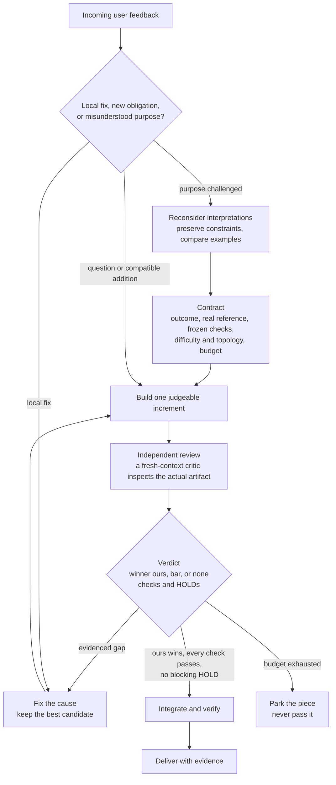

# Gauntlet Loop

Gauntlet Loop is a reusable skill for building, reviewing and revising agent work against a concrete reference and explicit acceptance checks. Its goal is dependable delivery with less human corrective effort. Current skill release: **[5.2.0](https://github.com/Ademord/gauntlet-loop-public/releases/tag/v5.2.0)**. A skill directs the process; it cannot guarantee that every result is correct.

This repository also holds the tools, experiments and history used to decide how the skill should evolve. [STATUS.md](STATUS.md) separates verified behavior from unproven performance claims. No general performance advantage over a capable native agent has been established.

## Quick start

Paste this into your AI coding agent:

```text
Install or update Gauntlet Loop to its latest published release by following https://github.com/Ademord/gauntlet-loop-public/blob/main/INSTALL.md; check existing installs and preserve local changes, then explain it in two short sentences and ask what task I want help with.
```

## One project, development and releases

`main` is the continuing home for the skill, supporting tools, research and version history. Development branches hold unfinished changes temporarily. Reviewed work is integrated into `main`; a release identifies a particular usable skill package. New research or tooling on `main` does not automatically change that package or its version.

The work developed on `codex/calibration-and-measurement-repair` belongs in this same project:

| Work | Where it lives | What it contributes |
| --- | --- | --- |
| Current usable skill and portable package | [skill/](skill/SKILL.md), [dist/](dist/README.md) | The current reviewed skill, including reconsideration and continuity during incoming messages |
| Chronological versions and release reviews | [versions/](versions/README.md), [gauntlet/](gauntlet/README.md) | What changed, why, and how each release was checked |
| Fifty milestones, research and experiment records | [research/program/](research/program/README.md) | Candidate decisions with scoped evidence; not fifty required features |
| Graph assessments and task-driven repairs | [architecture/](research/program/architecture/README.md), [readiness/](research/program/readiness/README.md) | What real work exposed, what was repaired or rejected, and remaining boundaries |
| Recorder, validation and research utilities | [tools/](tools/README.md), [observer](ledger/OBSERVER.md) | Optional support for measurement and checks, with documented limits |

Some observations justify code changes, others a later skill revision, and others a decision to stop. Retaining a failed experiment on `main` preserves evidence; it does not endorse the failed candidate. Original results and archived versions remain intact. Raw recordings, personal documents and local configuration remain outside the public repository.

The [community backlog](research/program/backlog.md#community-candidates-23-september-2026) records possible improvements to onboarding, a portable demonstration and outcome measurement. The demonstration's domain remains undecided; no new framework, paid experiment or skill release is scheduled by those entries. See [contribution and release rules](CONTRIBUTING.md#branches-and-releases).

## How it works



Findings are classed as deterministic, external, or judgment. From a piece's third review round, an uncorroborated critic judgment cannot force a revision; current user instructions remain authoritative. Every run records its difficulty estimate, topology, reviews, and outcome, so later runs can test where the extra machinery pays.

## How it evolved

| Version | What it was, and what it improved over the previous one (or did not) | Where |
| --- | --- | --- |
| **The technique**<br>2026<br>Matt Shumer | A prompt from the [Claude of Duty](https://github.com/mshumer/Claude-of-Duty) work: a harsh, separate critic compares the work blind against a real, named reference, and the loop does not stop until the work wins. | [robonuggets/gauntlet-loop](https://github.com/robonuggets/gauntlet-loop) |
| **v1**<br>6 Aug 2026<br>Jay E, RoboNuggets<br>CC BY 4.0 | The technique packaged as a reusable skill. The bar must be named, fetchable and comparable; builder and critic are separate agents with fresh context; the verdict is binary; the exit is winning, never a round count. Ships a table of good bars per goal type, two filled examples, and a list of what breaks a loop.<br>**Improved:** the technique became repeatable and portable.<br>**Did not:** no budget, so a loop that never wins never stops; no record of verdicts or evidence; tone ("harsh") is the only quality lever. | [versions/v1](versions/v1/SKILL.md)<br>1 file<br>1,400 words |
| **v1-local**<br>before 9 Sep 2026<br>Franco Ribera<br>unversioned | v1 plus software-delivery checks a user can select: a testing workflow green on the reviewed commit, a hosted demo, an offline download, a clean public copy, a README with a real screenshot, regressions on real user journeys. Adds five check statuses and a fixed delivery format.<br>**Improved:** software work gets a definition of done beyond the critic's preference.<br>**Did not:** still no budget; the skill tripled in size. | [versions/v1-local](versions/v1-local/SKILL.md)<br>2 files<br>4,400 words |
| **v2**<br>9 Sep 2026<br>Franco Ribera | A team tier (two solvers, four challenger roles, a reference researcher, a final reviewer), rules for admitting and correcting shared knowledge, a HOLD any critic can raise to stop an acceptance, a resumable stopping record, and an optional auditable agent-language experiment.<br>**Improved:** multi-agent runs get governance, and one dissenting critic can block a bad acceptance.<br>**Did not:** still no budget; the role roster invites committee growth; checked only by one read-only scenario walkthrough. | [versions/v2](versions/v2/SKILL.md)<br>5 files<br>7,600 words |
| **v3**<br>9 Sep 2026<br>Franco Ribera, after comparing v2 with oh-my-pi | Controls and records rather than new method. Solo by default, team only on request; a per-piece budget (soft limit 6 rounds or 120 requests, hard stop at 1.5 times that) that parks a piece and never passes it; a fixed verdict record; isolated workspaces for parallel builders; no silent model substitution; a run log so workflows can be compared.<br>**Improved:** the first protection against runaway loops and the first comparable run records.<br>**Did not:** added an example model mapping and a claim about vendor benchmarks that were opinions, not measurements; forbade builders from running tests; its four reference files were never shipped with it. | [versions/v3](versions/v3/SKILL.md)<br>1 file<br>4,300 words |
| **v4.0.0**<br>12 Sep 2026<br>Franco Ribera, from ten published sources | A rewrite around evidence. `winner: ours / bar / none` replaces the harsh critic; builders may test locally while acceptance stays independent; verdicts are bound to artifact, reference and criteria identities; shared run budgets with an integration reserve; explicit HOLD dispositions; best-candidate retention; checkpoints and resume; optional environment-probed lessons. The v3 model mapping is removed.<br>**Improved:** acceptance rests on evidence instead of tone, and budgets and recovery are explicit.<br>**Did not:** dropped the bar table, the filled examples, and the list of what breaks a loop that v1 to v3 carried, a loss in teachability nobody measured. | [versions/v4](versions/v4/SKILL.md)<br>8 files<br>9,500 words |
| **v5.0.0**<br>17 Sep 2026<br>Franco Ribera, with a Claude lead and critic agents, from six papers | Every expensive mechanism becomes conditional on what can be verified: evidence classes on findings and a revision ladder, so that from the third review round opinion alone cannot force a revision; a recorded difficulty estimate with a `light` topology for easy, checkable work; a budget for retrieving lessons and a ledger of whether they helped; a resume validation record; completion-time records. Built by running the skill on itself against frozen checks; independent critics found a mechanical deadlock and a series of rule conflicts, all fixed before acceptance.<br>**Improved:** effort goes where evidence exists, and every run records what is needed to test that.<br>**Did not:** nothing shows it beats v4; the examples v4 dropped are still missing (backlog B-020); the entrypoint sits 11 bytes under its 16,000-byte limit. | [versions/v5](versions/v5/SKILL.md)<br>8 files<br>12,400 words |
| **v5.1.0**<br>19 Sep 2026<br>Franco Ribera, with a Claude lead and four critic agents | No new mechanism. It restores what v4 dropped for size, into a reference read only when a bar is being set, a prompt drafted, or a loop is stalling: bars by goal type, two filled prompts, and the list of what breaks a loop. The rest is wording the v5 run left ambiguous and a gauntlet on v5 itself found: which route wins when a message asks for a prompt about doing work; what `bar` means when the bar is a known-failing artifact, so it can never read as the broken original winning; what a per-piece soft limit means when a small user cap makes soft and hard coincide; a prompt-length target decided by measuring the template instead of guessing; and two milestone fields, task class and features enabled, taken from the vocabulary the run ledger already used rather than a second invented one. **Did not** improve the loop itself, and nothing here is benchmarked. Its first review round returned four verdicts, nine blocking findings, and one defect worth naming: the two fields were required in three places and carried in none, while the package claimed otherwise in writing | [versions/v5.1.0](versions/v5.1.0/SKILL.md), [run](gauntlet/v51-upgrade-2026-09-19/progress.md) |
| **v5.2.0**, current<br>25 Sep 2026 | Adds a route from conceptual dissatisfaction to bounded reconsideration without waiting for repeated critic failures. Incoming messages retain unfinished work; stops and invalidating corrections affect workers promptly. Independent interpretations precede discussion, user priorities remain authoritative, and the resulting artifact still needs independent review. The same behavior is carried in standalone prompts and examples. **Limits:** scenario and consistency checks do not demonstrate reduced corrections, live scheduling enforcement or comparative performance; real-task pilots remain observational. | [skill/](skill/SKILL.md), [upgrade record](gauntlet/v52-reconsideration-2026-09-25/progress.md) |

By v5.1 the skill had grown from about 1,400 to 12,400 words, almost nine times. The v5.2 package stays within the existing entrypoint and portable-file byte limits. No version has been benchmarked against the one before it: each was checked by release review, and v5 by independent critics against frozen checks. Whether the growth pays is the question the [research program](research/program/README.md) is built to answer. Identities, what was preserved byte for byte, how each version was evaluated, and attribution are in [versions/README.md](versions/README.md).

## What is in this repository

| If you want to | Go to |
| --- | --- |
| install or read the current skill | [skill/](skill/SKILL.md), and [dist/](dist/README.md) for the single file and zip |
| see every earlier version, with identities and attribution | [versions/](versions/README.md) |
| understand why v5 is shaped the way it is | [research/thesis/v5-thesis.md](research/thesis/v5-thesis.md) |
| read the paper notes behind a version | [research/scans/](research/scans/README.md) |
| follow or join the research program | [research/program/](research/program/README.md) for indexed milestones, evidence and experiment records |
| inspect a complete real run: the one that produced v5 | [gauntlet/](gauntlet/README.md) |
| run the tooling | [tools/](tools/README.md) |
| use prior feedback during project work | [project feedback check](research/program/feedback/README.md), enabled only with private local configuration |
| inspect optional community improvements | [backlog candidates](research/program/backlog.md#community-candidates-23-september-2026) |
| see what is verified, untested, and next | [STATUS.md](STATUS.md) |
| contribute a paper, a run, or a change | [CONTRIBUTING.md](CONTRIBUTING.md) |

## Lineage and license

The technique is Matt Shumer's; v1 was packaged by Jay E at RoboNuggets under CC BY 4.0; later versions are by Franco Ribera. Skill text, run records, and research are CC BY 4.0 and the tools are MIT. See [LICENSE.md](LICENSE.md) and the attribution in [versions/README.md](versions/README.md#attribution).
