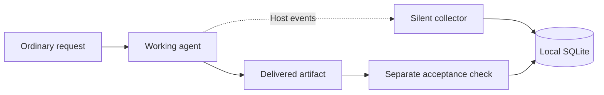

# Passive observation of ordinary tasks

Use a fresh task with only the user's ordinary request. The collector is a host process; it is not an agent-loaded skill. Keep its SQLite database, research plans and evaluator records outside the working task's checkout. Only explicitly registered session IDs are recorded.



## What is implemented

[observer.py](../tools/observer.py) stores enrolled sessions and allowlisted hook metadata, deduplicates tool events with stable identities, preserves identity-less event arrivals, and reports partial observations. It makes no model calls, injects no context, and does not steer or retry the worker. The legacy [run ledger](SCHEMA.md) remains unchanged.

| Available in this prototype | Not established by hook metadata |
| --- | --- |
| Receipt timestamps and observed event counts | Exact task execution time or active human effort |
| Tool start/end observations where hooks fire | Complete tool coverage, tool success or independent test acceptance |
| Reported model and subagent lifecycle metadata | Completed reviewer counts or attributable descendant usage |
| Separate outcome records with artifact/check identities | Automatic truth of an evaluator's assessment |
| Collection diagnostics | Guaranteed complete recording |

Tokens, dollar cost and human minutes remain `null` with missing reasons. The existing transcript parser is Claude-specific and is not a Codex usage adapter. Native [App Server](https://learn.chatgpt.com/docs/app-server) usage events offer a future integration point; its connection and accounting semantics must be qualified separately.

[contact_metrics.py](../tools/contact_metrics.py) adds external contact labels and user-reported resolution. A follow-up is not automatically a correction. Labels distinguish the initial request, correction, clarification response, approval, scope change, new request, confirmation and unknown. Revisions preserve earlier labels. Reports expose both received messages and work contacts, known corrections, unclassified records, contacts through a linked resolution, and reported active minutes. Confirmation and approval do not add work contacts. Unclassified messages keep exact captured correction totals unknown; first-pass resolution also requires an explicit, linked user resolution and unchanged scope. These are counts of captured records, never proof of complete conversation coverage.

```text
python tools/contact_metrics.py --db /external/private/observations.sqlite3 label codex:SESSION-ID EVENT-ID correction --actor auditor --source CHECK-REFERENCE
python tools/contact_metrics.py --db /external/private/observations.sqlite3 resolution codex:SESSION-ID resolved --event-id EVENT-ID --actor auditor --source CHECK-REFERENCE --evidence USER-CONFIRMATION-REFERENCE
python tools/contact_metrics.py --db /external/private/observations.sqlite3 report codex:SESSION-ID
```

Classify outside the worker's task using the actual conversation. An auditor must cite evidence for a user-reported resolution; a passing automated check belongs in the separate outcome table. Missing human minutes remain unknown. Setup, infrastructure repairs and research effort need their own cost records; message counts do not measure that labor.

## Prepare a local database and enroll a task

Choose an absolute database path outside the worker's checkout. Keep real paths in gitignored `*.local.json` configuration; do not commit the database or diagnostics.

```text
python tools/observer.py --db /external/private/observations.sqlite3 init
python tools/observer.py --db /external/private/observations.sqlite3 register SESSION-ID TASK-ID --config ledger/observer-session.example.json
python tools/observer.py --db /external/private/observations.sqlite3 report SESSION-ID
```

Replace placeholders and the [example session configuration](observer-session.example.json) with observed host settings. Enrollment is explicit and cannot silently overwrite an earlier registration. If enrollment occurs after work has started, earlier activity is missing; this prototype always reports incomplete coverage.

The `hook` command consumes JSON on stdin. Unregistered sessions are ignored. Hook-event metadata excludes prompts, tool arguments/results, assistant messages, working-directory paths and transcript contents. The collector records a payload hash for identity/provenance without storing the payload. Hook-mode failures remain silent and produce a bounded local diagnostic when storage permits; a failed write is not evidence that no activity occurred.

## Connect the host

[observer-hooks.example.json](../tools/observer-hooks.example.json) is an uninstalled fragment. Replace its command with the absolute Python executable, collector and database paths for the selected host. Merge reviewed entries into the host's existing hooks; preserve other hooks and normal agent capabilities. Check the actual Windows shell invocation before using it for work.

Codex [hook documentation](https://learn.chatgpt.com/docs/hooks) specifies lifecycle events, silent success, and review/trust of exact hook definitions. Do not bypass that trust step. The fragment emits no instructions or scores. Tool hooks do not cover every specialized path, and transcript format is not a stable hook interface.

Before counting observations, verify one enrolled session is captured, one unenrolled session is ignored, no collector text enters the worker context, and interrupted work remains visible as incomplete. Unit tests using simulated events do not complete this host-integration check. No live task or global hook installation is implied by creating this prototype.

An independent acceptance result is recorded separately with `record_outcome` in the Python module. A host `Stop`, an assistant saying “done”, and independent acceptance are different facts. The outcome API stores an assessment and its evidence identities; it does not run or certify the evaluator.

## Installed host adapter and verification

[observer_host.py](../tools/observer_host.py) prefixes session keys with `codex:` or `claude:`. It can enroll an existing ID or arm the next session at one exact host and directory for up to one hour. Arming is explicit, expires, and can be consumed only once. Other sessions are ignored. Use the frozen runtime path recorded by the installation plan for enrollment/report commands; editing the repository does not silently change installed code.

The private pending-enrollment table stores the selected directory for routing. Event records still exclude working paths. Raw host diagnostic transcripts used for smoke verification also remain private; the metadata recorder does not copy those transcripts.

```text
python /private/runtime/observer_host.py --db /private/observations.sqlite3 --host codex arm --cwd /exact/project --task TASK-ID --config /private/task.local.json --ttl-seconds 300
python /private/runtime/observer_host.py --db /private/observations.sqlite3 --host claude register SESSION-ID TASK-ID --config /private/task.local.json
```

[observer_install.py](../tools/observer_install.py) prepares an additive merge, freezes the collector modules outside the checkout, preserves existing settings/handlers, checks for concurrent edits and creates exact backups before applying. Its private plan contains local settings and must never be committed. Claude uses its documented executable-plus-arguments form; Codex uses a command verified on this Windows installation. Codex trust was granted through its native review interface. The installer never modifies trust storage or bypasses it. [Claude hook contract](https://code.claude.com/docs/en/hooks), [Codex hook contract](https://learn.chatgpt.com/docs/hooks).

The September 21 smoke test installed ten Claude handlers and nine Codex handlers. Codex captured a real request, three tool starts/ends, Stop and SessionEnd; an external diagnostic content check passed. Claude first captured a usage-credit failure. A later Opus/high invocation with normal MCP configuration overshot its soft $1 guard ($3.24448 API-equivalent usage) on the first model request. A Read-only Opus/high invocation with MCP servers disabled for that invocation completed the request, tool and Stop/SessionEnd cycle, reporting $0.042224. Both failed attempts remain recorded. These fixtures establish engineering compatibility only, not full MCP coverage or a representative performance comparison. See the [initial record](../research/program/materials/observer-native-validation.json) and [Opus follow-up](../research/program/materials/observer-native-validation-002.json).

The CLI dollar guard is evaluated after incurred usage and is not a guaranteed pre-request ceiling. For bounded subtask diagnostics, expose only task-required tools and record requested/resolved model, effort, server configuration, all attempts and actual host-reported usage. Changing tool availability is a treatment change, so do not compare these diagnostics as evidence of orchestration gains. Complete interruption/descendant coverage and recorder overhead remain unqualified.

To reverse installation, remove only entries matching the frozen runtime command (and Claude arguments), preserving other hooks. Exact pre-install backups can restore the original file only if there have been no later settings changes. Removal/change of a Codex definition requires native trust review again when re-enabled.

## Git checkpoints and agent memory

Raw database snapshots and host transcripts stay private. [observer_checkpoint.py](../tools/observer_checkpoint.py) exports a small manifest for explicitly selected sessions and hashes a consistent private SQLite snapshot. It includes missing-data status and failures, excludes raw identifiers/configuration/text, and neither commits nor pushes anything. Review the manifest before adding it to Git.

```text
python tools/observer_checkpoint.py --db /private/observations.sqlite3 --private-snapshot /private/snapshots/checkpoint.sqlite3 --output research/program/materials/checkpoint.json --session codex:SESSION-ID
```

Daily exports can provide a backup cadence. No daily commit automation is enabled. Public pushes should include reviewed manifests and code, with private evidence retained separately. A Git checkpoint preserves evidence; making agents retrieve that evidence as memory changes the intervention and needs a separate comparison. The [Agora design note](../research/program/materials/git-memory.md) records the distinction and the paper's limits.

The [storage measurement](../research/program/materials/observer-storage.md) found a 56 KiB live database. A synthetic 10,000-event probe measured about 554 additional bytes/event. Retention can use verified lossless archives and rebuildable indexes when necessary; no history deletion, compaction or scheduled cleanup is enabled. Preserve the evidence behind accepted decisions as well as failures and corrections.

## What “unaware of the experiment” means

The defensible claim is that the task prompt did not disclose evaluation. Start a fresh task rather than forking this research conversation. Shared memories, repository files, hook UI and assigned workflow instructions may still reveal context; complete blinding is unverified. A Gauntlet treatment necessarily supplies its workflow instructions, while its hypothesis and scoring can remain outside the task.

Every session is labeled `observational`. Ordinary records can reveal bottlenecks and suggest experiments. They cannot establish that more agents or a particular skill caused a better outcome: task difficulty and human intervention may differ. Comparisons that support adoption still use the [research program](../research/program/README.md) and its frozen, distinct treatments.
