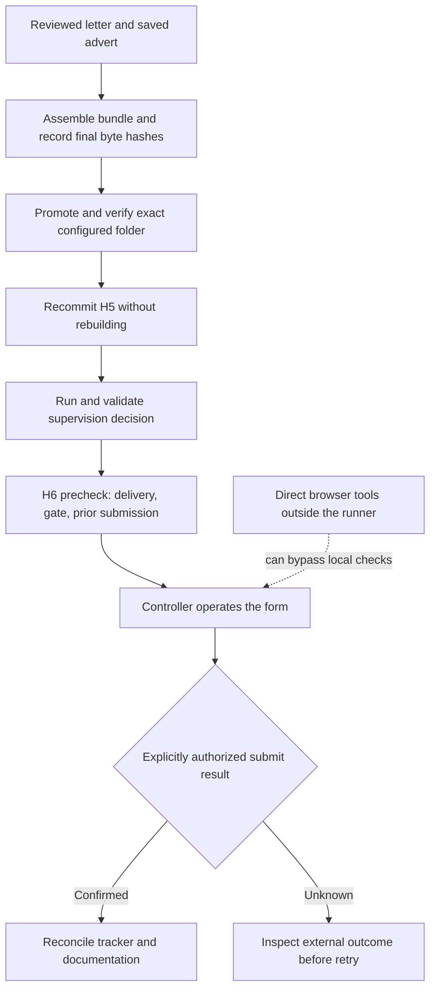

# P006 — delivery and controller boundaries

A real application reached its review page while the approved documents remained in a drafts folder. The user found the missing delivery. Promotion before form filling was already required, but the controller used direct browser tools outside the runner. This was a controller failure and **one human delivery correction**.

The files were then delivered to the required flat folder and verified. The user explicitly authorized submission; portal confirmation, a matching receipt email and the singleton tracker were reconciled privately. The original [P005 preparation report](APPLICATION-PREPARATION.md) remains unchanged: it describes the earlier preparation checkpoint, before sign-in and submission. Recovery records preserve what actually happened without inventing historical stage checks.

Private package **1.2.0** is integrated. **42/42 synthetic regression methods passed**: 14 delivery, 4 attachment compatibility, 12 recovery and 12 independent boundary methods. The independent reviewer reran 30 of those methods; this is a subset, not another 30 trials. Separate checks passed on the current private delivery and form record. An H6 precheck on the already-submitted application refused to start with the expected exit code 3. These are engineering and task-completion observations; comparative performance remains unproven.

[Indexed record and artifact identities](P006-controller-boundaries.json). The implementation, fixtures and private evidence are not in this public checkout, so these results cannot be independently reproduced from the public repository alone. Independent implementation and final instruction reviews passed. The bundled skill validator also passed using an existing dependency; the earlier missing-dependency result is preserved.

The form and submission edges still belong to the controller. A local precheck cannot intercept arbitrary direct browser calls. The raw snapshot adapter also emits no qualified stage receipt graph: it remains conservative at `inspect_stage` or earlier unknown/reconciliation checks. Delivery is additionally required only after independently qualified stage evidence exists. The usable normal runner path is promotion → H5 recommit without rebuilding → GATE → H6 precheck; no automatic planner bridge is claimed.

| Failure checked | Implemented response | Boundary |
| --- | --- | --- |
| Draft-only, missing, misplaced or changed delivery | Exact role filenames in the independently configured flat root, full SHA256 and size checks at H6; no `--force` bypass | Point-in-time local identity, not the employer's uploaded bytes |
| Failed gate process returns parseable JSON | Check exit status and decision structure; record a current failure while preserving the old artifact | Other stage retry rules remain incomplete |
| Old gate reused after failure | H6 blocks until successful regeneration; manual success cannot resurrect it | Well-shaped decisions are not fully bound to all changing inputs |
| Repeated start after completion or ambiguous submission evidence | Refuse the tested H6 start states and require reconciliation; legacy markers alone do not prove submission | No atomic reservation around direct browser submission |
| Renderer/checker disagree on attachments | Current audit objects render with escaped evidence; historical pairs remain display-compatible | Historical pairs still fail the current audit |

| Investor question | This checkpoint |
| --- | --- |
| **What exact claim are you testing?** | The tested runner entry points refuse the specified invalid states while the normal promotion/gate path stays usable. Metric: 42 synthetic methods passed, plus the separate private checks above. |
| **Compared with what?** | The previous controller and reproduced failures. This is a before/after engineering repair, not a controlled comparison with another capable agent. |
| **What result would make you stop?** | Do not install if an invalid state reaches H6 through the tested runner interfaces, force bypasses a hard check, or the normal sequence becomes unusable. These are implementation acceptance conditions, not a preregistered performance study. |
| **Where did your approach lose?** | The user had to correct delivery. Review found numeric-overflow, malformed-marker and documentation defects; they were corrected before integration. Legacy manifests need reviewed byte identities. Old snapshots cannot gain readiness from delivery alone. Direct browser calls still bypass the runner. |
| **What did this really cost?** | Unknown. No additional paid worker experiment was launched, but controller/reviewer usage, failed preparation, evaluation and human time were not fully measured. Unknown is not zero; P005 usage remains in P005. |
| **What decision does the next expenditure enable?** | Whether genuine stage receipts and one owned browser executor are needed to close the remaining enforcement boundary. Neither exists as a qualified integrated path, and this report does not authorize a new paid experiment. |

The largest remaining gaps are direct browser/raw-ledger bypass, the missing stage-receipt bridge, and the absence of atomic submission reservation and complete uncertain-outcome recovery. Gate input freshness and other failed-stage reruns also need concrete regression coverage. Visible attachment names do not prove remote byte identity; screenshot stitching can repeat content, so raw captures and text readback remain separate evidence.

Full pipeline runtime and the managed-agent environment remain unqualified. No milestone is promoted, no cost saving is claimed, and no comparative orchestration gain is established.
