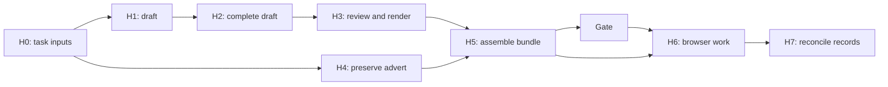
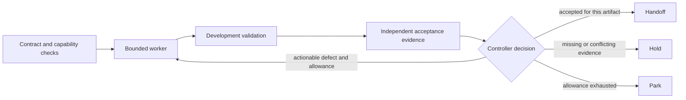

# Graph workflows: where they fit

Snapshot follow-up: [P003](SNAPSHOT-ADAPTER.md) records the accepted source adapter, conservative recovery rules and separate read-only real-source inspection. P002 and the original assessment below retain their historical scope.

Implementation follow-up: [P002](IMPLEMENTATION.md) records the accepted controller repair and read-only planner. The assessment below remains the original recommendation and source snapshot.

Decision **GRAPH-001**, 21 September 2026. [Indexed record](GRAPH-001.json). Source inspection of Gauntlet at `ba71895`; private application-pipeline inspection is recorded by hash. This is an architecture assessment, not an implemented controller, benchmark, skill upgrade or permission to dispatch workers.

**Recommendation: put stable rules in executable controllers and keep agent judgment inside bounded tasks. Repair and reuse the existing application workflow first. Keep Gauntlet's controller small until actual recovery or scheduling needs justify a framework.**

## What the video establishes

The supplied screenshots match Google Cloud Tech's [Graph Engineering with ADK](https://www.youtube.com/watch?v=Mzr7byMFy_4). The linked [Google codelab](https://codelabs.developers.google.com/adk2/instructions) demonstrates function nodes, joins, rule-based routing and model nodes. Its weather input is a canned dictionary; substituting an actual API is a suggested next step. The demonstration supports a design pattern, not a measured reduction in hallucinations for our work.

The strongest lesson is to fetch evidence and compute known rules outside the model. Multiple calls or a graph alone do not establish factual correctness. A single capable agent with real tools is also a competent alternative; the giant-prompt-without-data example would be an inadequate baseline for our comparisons.

Three qualifications matter:

- A deterministic route is repeatable for the same validated input, policy version and state. It can still act consistently on a wrong extraction or stale record. Missing evidence needs an explicit unknown route.
- Function nodes use no model tokens for those operations; APIs, CPU, storage, implementation and maintenance still cost resources. Parallelism can reduce waiting time while leaving total work unchanged or increasing it.
- Fixed workflows, dynamic workflows and autonomous agents can be nested. For example, a fixed application process can contain a flexible browser worker. A variable-length list of jobs can be processed by ordinary bounded code; it does not require a model to invent the graph.

These are established workflow patterns. [Anthropic's earlier engineering guidance](https://www.anthropic.com/engineering/building-effective-agents) also distinguishes predefined workflows from model-directed tool use and recommends starting with simple compositions. That guidance and the ADK documentation are engineering sources, not comparative performance evidence for Gauntlet.

## What already exists

| Surface | Observed implementation | Consequence |
| --- | --- | --- |
| Gauntlet skill | [Execution contract](../../../skill/references/execution-contract.md) and [skill](../../../skill/SKILL.md) describe roles, budgets, ownership, acceptance and recovery. | A useful protocol; instructions alone do not enforce every transition. |
| Calibration controller | [run_calibration.py](../../../tools/paired_study/run_calibration.py) fixes build, self-check and review/repair stages, snapshots artifacts and grades them. Alternative branches run sequentially; repair follows review unconditionally. | Reuse accounting and artifact patterns. It is a specialized experimental controller, not a general scheduler or concurrent join. |
| Observer and readiness | [observer.py](../../../tools/observer.py) records supplied events/outcomes; [readiness.py](../../../tools/readiness.py) validates triage records. | Reuse them. Neither selects or launches runtime work. |
| Research index | [program.py](../../../tools/program.py) checks milestone dependencies and supports an offline inventory driver. | Milestone dependencies order research decisions; they are not the execution graph of a task. |
| Managed execution | [MAQ-001](../readiness/MAQ-001.json) failed the proposed read/network boundary. | A graph framework does not repair isolation. Arbitrary worker execution remains unqualified. |
| Private application pipeline | `run.py` already contains H0-H7 dependencies, a join, gate and artifact checks; `next_job.py` classifies queue entries. | Existing graph structure should be repaired before a new orchestration layer is introduced. |

The private pipeline's controller fails syntax parsing at line 296. Package hashes match that file, so hash consistency does not prove executable readiness. A skill banner and package version also differ. P001's discovery layer remains uninstalled. These are inspected facts, not evidence that graph architecture itself failed.

Controller-mediated checks are not exclusive enforcement: the ledger can be appended separately, stage names lack a closed allowlist, and preflight is not automatically invoked. Form-record validity does not prove submission; a note mentioning the tracker does not prove its update. The queue can currently treat absent tracker input as eligibility. The gate also consumes an agent-written confidence number; that is not a calibrated probability and should not substitute for required evidence or authorization. These specific gaps are more actionable than adding more agents.

## Application pipeline: a fixed outer process

The existing dependency graph, as written but currently blocked by the syntax defect, is:

The proposed outer router should reconcile job identity, current tracker status, local file/attempt records, runtime readiness and the current task's authorization before choosing a next action. The existing authority split remains: the singleton tracker owns application status; the local ledger owns artifact records. A local submitted marker or conflicting evidence should also stop a duplicate attempt until reconciled. Do not create another tracker.

| Decision or task | Appropriate mechanism | Expected value and limit |
| --- | --- | --- |
| Locate installed pipeline, validate runtime, detect known submitted/expired jobs, check required files and current authorization | Deterministic code over explicit inputs | Fewer skipped prerequisites and unsupported ready claims; must preserve unknowns and actual job identity. |
| Read independent source, tracker and artifact snapshots | Bounded parallel reads, then a join | Possibly less latency; require timestamps, identity and explicit failure results. A finished branch is not necessarily valid evidence. |
| Draft text, interpret ambiguous requirements, understand unfamiliar forms | Agent judgment with supplied facts and scoped tools | Flexibility where rules are insufficient; truthful claims still require evidence. |
| Prepare advert while the letter is drafted | Existing independent H4 branch | Possible latency reduction. H1/H2 share `letter.json` and must remain ordered. |
| Handle discovered screening questions or attachments | Bounded dynamic tasks if needed | Useful when task count varies; deduplicate, limit concurrency and reserve shared budget. Start sequentially when ownership is unclear. |
| Browser submission and tracker mutation | One owner, explicit action identity and outcome reconciliation | Avoid conflicting browser actions and duplicate effects. Honor existing authorization; missing authorization is a wait state, not a reason to repeatedly reapprove authorized work. |

Useful routes include `blocked`, `unknown`, `already_submitted`, `expired`, `waiting_login`, `missing_user_fact`, `ready_to_prepare`, `ready_to_prefill`, and `submission_unconfirmed`. A prefill-only request must not become a submit request. An uncertain submit result goes to reconciliation, not an automatic retry. A later executor would need reservation and effect deduplication; none is claimed implemented here.

## Gauntlet: fixed controls around flexible workers

The proposed general delivery shape is:

Code should check artifact identity, required evidence, unresolved holds, allowance and permissible transitions. The critic can supply a structured assessment; it cannot make its judgment infallible by returning JSON. Existing comparison obligations still apply: mechanical tests alone cannot award a reference-comparison win. A worker stop event is not acceptance, and a graph's completion is not proof of delivery.

The worker may investigate and use tools autonomously inside its contract. A separate controller should own acceptance records and action authority; importing these concepts into the same writable folder does not establish that boundary. Public development validation and independent acceptance also have different purposes: let the worker see useful diagnostics while retaining independent checks and decision ownership.

## Reuse the milestones

| Existing milestones | Graph-related application | Timing |
| --- | --- | --- |
| M-037 Prompt versus controller; M-036 Machine-checkable records | Explicit states, artifact-bound decisions and allowed transitions | Main architectural fit now; no new milestone needed. |
| M-004 Stronger development feedback; M-033 Prefer native enforcement | One worker-accessible validator, qualified through the actual interface | Current prerequisite. A trusted static validator can be scoped separately from arbitrary candidate-code execution. |
| M-006 Ownership and isolation; M-008 Parallel scheduling | Separate outputs, one owner of shared browser/state, valid joins | Use only for independent work with a demonstrated waiting cost. |
| M-012 Artifact-bound acceptance; M-024 Independent acceptance coverage | Bind evidence to exact candidate and check versions | Necessary before a controller may announce acceptance. |
| M-014 Interruption recovery; M-041 Idempotent operation retries | Durable state and reconciliation of uncertain effects | Before unattended retries or resumable external actions. |
| M-011 Budget allocation and parking; M-045 Quota-aware scheduling | Shared allowance across branches, retries and resumes | Preserve existing accounting; add concurrency controls when dispatch exists. |
| M-015 Light versus heavy routing; M-031 Remove redundant instructions | Keep judgment only where rules cannot settle the choice | Investigate from observed need; no automatic LLM router. |

The milestone DAG, runtime workflow and evidence/provenance graph answer different questions: what to investigate next, what may execute next, and why a claim is believed. They can reference the same IDs without becoming one graph or requiring a graph database.

## Smallest next work and how to judge its value

1. **Qualify one named development validator through the worker's actual interface.** A trusted static parser with constrained inputs is a narrower capability than running arbitrary candidate-authored tests. The latter still needs the failed sandbox boundary resolved. Record capability success separately from any later reduction in corrections.
2. **Repair and qualify the existing application controller, then expose one read-only next-action planner for one job.** Use saved/synthetic inputs and adapter fixtures; keep browser and tracker writes outside this increment. Implement it as a bounded worker task after the worker interface is ready. This assessment does not silently turn the controller into the pipeline implementer.
3. **Resume ordinary work once these stated prerequisites pass.** Add dynamic scheduling, durable graph execution or a framework only when a repeated task exposes a specific need that the existing host and small controller do not meet.

The first planner's engineering checks should reject invalid stages and failed preflight; keep missing tracker status unknown; wait for both required join inputs; reject stale artifact identities; route missing facts/login correctly; prevent submitted jobs becoming eligible; and reconcile uncertain submissions. Duplicate events must not produce duplicate effect proposals. Valid controls must still advance: blocking everything is not success.

Record exact-route correctness against independently authored fixtures, false-ready/false-block counts, repeated-event behavior, latency and preparation effort. These checks establish scoped engineering behavior. Later, assess first-pass accepted deliveries, correction contacts and active human minutes, unsupported completion claims, regressions, elapsed time and full cost. Compare an equally equipped native agent with the same data, tools and acceptance obligations. Use recorded/synthetic external effects for paired comparisons; do not send duplicate real applications for evaluation.

Abandon or narrow a change if it does not resolve the stated gap, blocks valid work, or costs more to maintain than the responsibility it replaces. Keep familiar documentation rather than forcing every task through a framework. Do not turn preparation into an open-ended prerequisite list or claim dollar savings merely because we reused documentation.

## Framework decision

ADK v2's [graph routes](https://adk.dev/graphs/routes/) and [dynamic workflows](https://adk.dev/graphs/dynamic/) implement the mechanisms shown. Adoption is **deferred**, not rejected. First compare the existing host plus a small controller with a pinned framework adapter against the same actual requirement: for example, recovery across process loss or a genuinely dynamic join. Count implementation, maintenance, observability and migration costs as well as runtime usage. Preserve the selected worker model/effort and native tools.

Replay deserves explicit qualification. ADK's [version-pinned dynamic-node guidance](https://github.com/google/adk-python/blob/d57c84f13baf53cfd910c2155449f8c4254e01c5/docs/guides/workflow/dynamic_nodes/index.md) says a resumed parent re-executes while completed child results can be replayed. That does not guarantee exactly-once external effects if an action succeeded before its checkpoint was recorded. Keep effects out of an unguarded parent body and reconcile uncertain outcomes.

No framework was installed, no pipeline deployed, no worker experiment run and no milestone promoted in this assessment. The public private-source references support provenance but do not make the private application pipeline independently reproducible from this checkout.

Tracker extraction follow-up: [P004](TRACKER-NORMALIZER.md) records a rejected candidate after one repair, retained compatibility failures and separate diagnostic replays. No integration occurred. P003, P002 and the original assessment retain their historical scopes.
