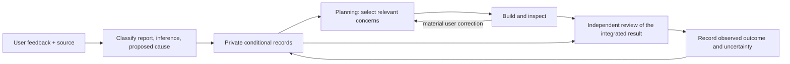

# Project feedback check

This opt-in project workflow makes relevant past dissatisfaction available to the lead and the existing independent reviewer. It uses the skill's [conditional lesson mechanism](../../../skill/references/learning-and-evolution.md); it does not train model weights or implement reinforcement learning. Recording events alone does not change an agent's behavior.

## Private inputs and discovery

The repository [agent instructions](../../../AGENTS.md) route enabled project work here. The gitignored `ledger/feedback.local.json` supplies an `enabled` flag and absolute paths to a private register and review records. Without that configuration, the check is disabled. Keep sources, examples, personal preferences and review records outside the public repository. A user's explicit feedback can be captured from the current conversation without turning on broader transcript collection.

The register separates:

- **Reported dissatisfaction:** what the user said was wrong, with a source anchor. This establishes the report; it does not establish the underlying technical cause or prove that the reviewed application used Gauntlet.
- **Inferred risk:** something that might also disappoint the user. It has no historical negative outcome or invented user endorsement.
- **Proposed mitigation:** a conditional trigger, bounded action and artifact-based check. Its benefit starts as unknown.
- **Positive or contrary evidence:** what the user liked, accepted, or later changed. Preserve useful work and retire lessons that no longer fit.

Do not reduce a mixed message to a fabricated reward score. Preserve both praise and criticism with their scope. Keep explicit requests from a source task alongside the observation, while distinguishing them from authorization for the current task. Do not dilute a concrete request into a mere preference, or generalize it into a rule for unrelated tasks. For example, a request to shorten a confirmation notice does not establish a universal preference for short research reports.

## Where the check happens

1. **Before planning:** read the current goal and earlier commitments, then select at most three applicable concerns. Zero is valid when none matches; for a trivial edit, reuse an existing applicable selection rather than creating a new review ceremony. For each selected concern, name the present trigger and the artifact/state where it can be checked. Mark the disposition `applicable-now`, `not-yet-observable`, `not-applicable`, or `needs-clarification`, with a brief reason. A concern that will only be observable at handoff stays open until that point; defer it rather than marking it passed. Ask a question only when the missing answer changes a consequential choice and cannot be recovered from existing instructions or evidence. Routine uncertainty belongs with the lead.
2. **After a material correction:** record the literal issue and a separately labeled possible wider pattern. Check the affected journey, including earlier successful parts, without automatically restarting unrelated work. Current feedback changes the task when the user says so; version affected commitments rather than allowing a new inferred preference to silently replace them. Formal lesson-pool amendments follow the existing contract rules.
3. **At review/handoff:** give the existing independent reviewer the original purpose, integrated artifact, relevant feedback sources and open concerns. Do not supply the builder's preferred verdict. The reviewer first inspects the whole task against its purpose, then checks the selected concerns: what can the user understand, do, decide or experience at the relevant moments? This ordering is not a claim of blinded review. A label, count of completed edits or explanation in the handoff cannot substitute for information missing from the artifact. Use actual screens, files or behavior; where the artifact is unavailable, report that limit. Competing subjective designs can remain alternatives.
4. **At the checkpoint:** record the concern IDs/versions, review phase, artifact identity, disposition, observation, action and remaining gap. Later record user feedback if received. Keep `unknown` when there is no evidence of benefit. Record neutral, irrelevant and harmful uses too; lack of a new complaint is not confirmation of satisfaction. Preserve earlier records when revising a conclusion.

This adds no permanent reviewer role or approval ceremony. The lead owns selection and follow-through; the existing critic checks the delivered experience. Beauty, enjoyment, orientation and discovery can be legitimate purposes. Avoid rationalizing every existing element after the fact or forcing every element to justify a productivity decision.

## Admission and limits

An explicit current user requirement remains a requirement regardless of whether a proposed mitigation is validated. Candidate causes and remedies remain hypotheses; they cannot silently introduce acceptance requirements. Use the existing candidate/experimental/active admission and utility rules for claims about reusable procedures. Independent agreement on a source's meaning verifies scope, not future effectiveness. Promotion requires evidence from separate use; harmful reuse triggers suspension and review.

The [observer](../../../ledger/OBSERVER.md) collects allowlisted event metadata and excludes prompts and message text. It does not extract these concerns, retrieve them, identify dissatisfaction, or update a policy. The feedback check currently runs through project instructions and explicit lead/reviewer records; there is no background learner, database migration or automatic hook injection. Installing the released skill elsewhere does not enable this project's private feedback configuration.

The first checkpoint establishes a source-linked register and a retrieval procedure. It does not establish better design judgment, less user effort, complete recorder coverage or a performance advantage. Check whether a later real task uses the procedure and whether the resulting experience is accepted before expanding it.
